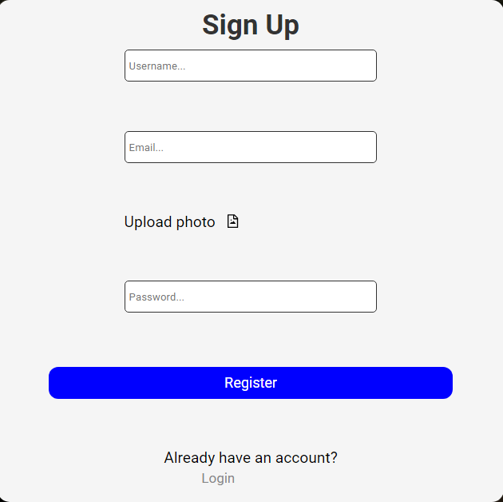
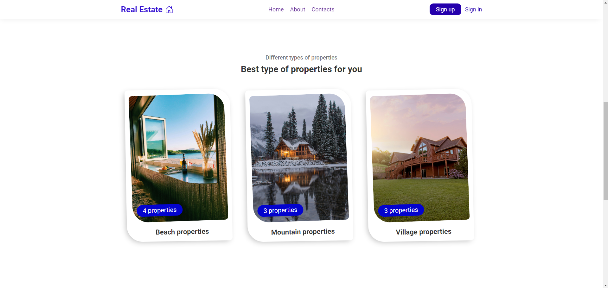

# Real Estate Full Stack App (MERN Stack)

## Table of Contents

- [Screenshots](#screenshots)
- [Features](#features)
- [Prerequisites](#prerequisites)
- [Getting Started](#getting-started)
- [Folder Structure](#folder-structure)
- [Technologies Used](#technologies-used)
- [Live Demo](#live-demo)

- ## Screenshots
 
- ;
- ;
- ;
- ;
- ; 
- ;
- ;
- ;
- ;
- ;
- ;
- ;
- ;
- ;
- ;


## Features

1. **User Authentication**: Secure user authentication and registration system.
2. **Property Management**: Create, edit, and delete your Properties.
3. **Property Search**: Filter and search by favourite criteria.
4. **Bookmark Properties**: Bookmark your favorite Properties.
5. **Yacht Management**: Create, edit, and delete your Yachts.
6. **Yacht Search**: Filter and search by favourite criteria.
7. **Comment on Properties/Yachts**: Make comments on properties and yachts.
7. **Contact System**: Contact owners of properties and yachts to purchase or ask questions.
7. **Profile Managment**: Update and Delete profile.
8. **Responsive Design**: Works seamlessly on both desktop and mobile devices.

## Prerequisites

- [Node.js](https://nodejs.org/) installed (v14 or higher).
- [MongoDB](https://www.mongodb.com/) installed and running locally or on a remote server.
- [Git](https://git-scm.com/) for version control.
- A text editor or integrated development environment (IDE) of your choice (e.g., Visual Studio Code).

## Getting Started

1. Clone the repository:

   ```bash
   git clone https://github.com/isek7or/REAL-ESTATE-Milestone-Project-3

2. Navigate to the project directory:

       cd REAL-ESTATE-Milestone-Project-3

3. Navigate to package.json folder:

       add the following dependency: "type": "module",

       delete the “test” on the scripts and add the following: "start": "nodemon index.js"

4. Navigate to the backend directory:
     
       cd backend

5. Create a `.env` file in the project root and configure your environment variables:
   
       PORT=5000
       MONGO_URI = mongodb+srv://<username>:<password>.@<yourclusterID>.mongodb.net/?retryWrites=true&w=majority
       JWT_SECRET = <yourkey>

6. Install backend dependencies:

       npm install
       
       npx nodemon

7. Return to the project root:

       cd ..

8. Navigate to client folder:

       cd client

9. Install frontend dependencies:    

       npm install

       npm run start


       


## Folder Structure
The project follows a standard MERN stack folder structure:

- client: Contains the React frontend application.
- backend: Contains the Express.js backend application.
- models: Define the MongoDB schemas and models.
- routes: Define the API routes.
- controllers: Handle route logic and interact with the database.
- db: Configuration files (e.g., database connection).

#### Frontend:

- React

#### Backend:

- Node.js
- Express.js
- MongoDB (Mongoose)


 ## Live Demo 

 Check out the live demo of the Real Estate Full Stack App [here](https://callz-real-estate.netlify.app/)


